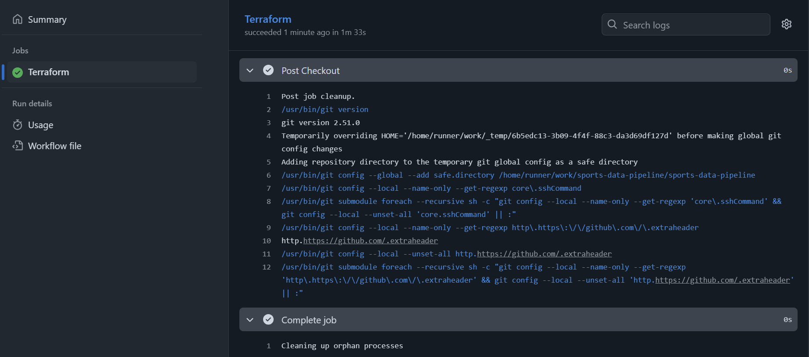
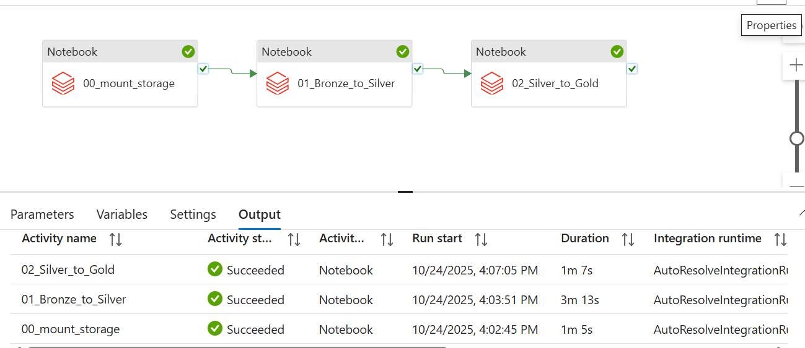
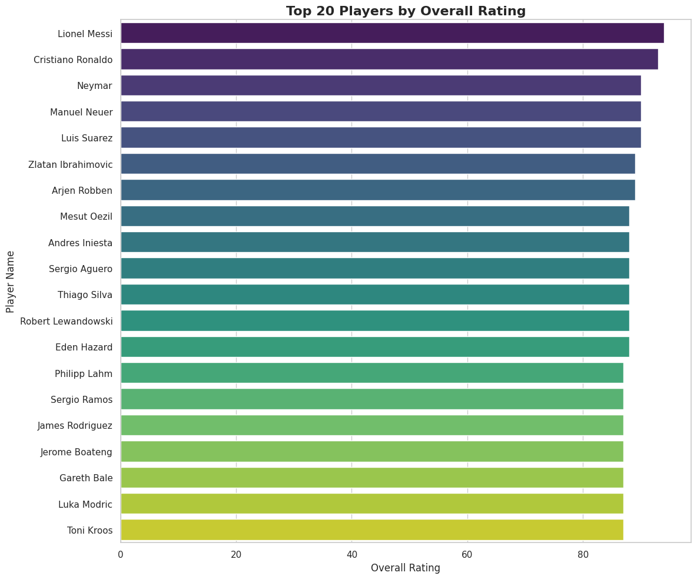
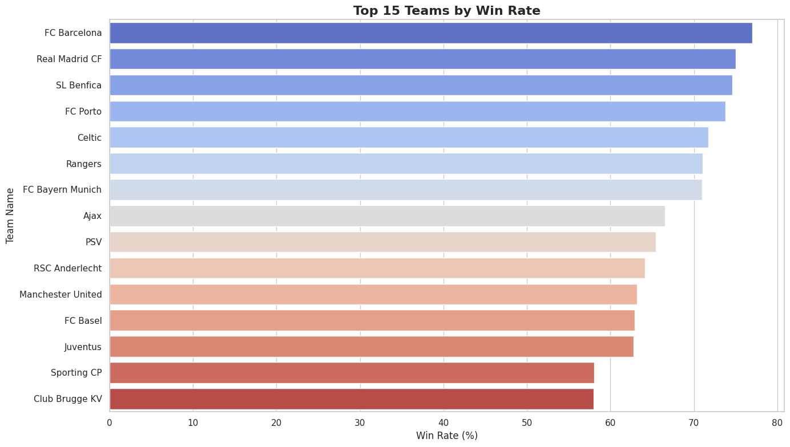

# ⚽ Sports Analytics DataOps Pipeline 🏆

**A Production-Grade Sports Analytics Pipeline with Terraform, GitHub Actions, Databricks, and ADF**

## 🎯 Project Objective

This project demonstrates the complete, end-to-end lifecycle of a modern data platform on Microsoft Azure. The primary goal is to build a fully automated, production-grade DataOps pipeline that deploys its own infrastructure via CI/CD and then runs an ETL process on a relational sports database (European Soccer Database).

The pipeline calculates key performance indicators (KPIs) like team win rates and player performance trends, storing the results in analytics-ready Gold tables.

## 🔧 Key Technologies

- **Cloud Platform:** Microsoft Azure
- **Infrastructure as Code (IaC):** Terraform
- **CI/CD (DataOps):** GitHub Actions
- **Storage:** Azure Data Lake Storage (ADLS) Gen2
- **Orchestration:** Azure Data Factory (ADF)
- **Transformation (Compute):** Azure Databricks (PySpark & Spark SQL)
- **Data Format:** Delta Lake
- **Secrets Management:** Azure Key Vault
- **Source Data Format:** SQLite Database

## 🏗️ Project Architecture

The infrastructure is defined using Terraform and deployed automatically via GitHub Actions. The data flows through a standard Medallion Architecture.


*Replace with the path to your architecture diagram image*

## 🔄 Phase 1: DataOps (CI/CD Workflow)

Infrastructure deployment and management are fully automated using GitHub Actions and Terraform with a remote state backend.

1. **Define (Terraform):** All Azure resources (Resource Group, Storage Account with fixed name, Key Vault, Data Factory, Databricks) are defined in `.tf` files within the `/terraform` directory.

2. **Secure (GitHub Secrets):** Azure Service Principal credentials (`ARM_CLIENT_ID`, `ARM_CLIENT_SECRET`, etc.) are stored securely in the repository's Actions secrets.

3. **Configure (Terraform Backend):** The `terraform/backend.tf` file configures Terraform to store its state file (`terraform.tfstate`) securely in the `tfstate` container within the deployed Azure Storage Account. This makes the pipeline stateful.

4. **Automate (GitHub Actions):** The `.github/workflows/main.yml` file defines the CI/CD pipeline triggered on pushes to the `main` branch.

5. **Execute (On git push):**
   - Checks out code
   - Installs Terraform
   - Runs `terraform init`, connecting to the Azure backend using stored credentials and configuration
   - Runs `terraform plan` to determine changes
   - Runs `terraform apply -auto-approve` to create or update resources in Azure. Because the pipeline is stateful, subsequent runs only apply detected changes.

### ✅ Successful CI/CD Run


*Replace with the path to your GitHub Actions screenshot*

## 🌊 Phase 2: Data Engineering (ETL Workflow)

This phase processes the European Soccer Database using ADF and Databricks.

### Dataset

- **Name:** European Soccer Database
- **Source:** Kaggle (`database.sqlite`)
- **Description:** A relational SQLite database containing 7 tables (`Match`, `Player`, `Team`, `Player_Attributes`, `Country`, `League`, `Team_Attributes`).

### Data Flow (Medallion Architecture)

#### 🥉 1. Bronze: Raw Ingestion

- **Action:** The `database.sqlite` file is manually uploaded to the `bronze` container in ADLS (`/mnt/bronze`).
- **Format:** SQLite

#### 🥈 2. Silver: Cleaned & Normalized Delta Tables

- **Orchestration:** ADF Pipeline (`PL_Sports_Analytics_ETL`) triggers the first notebook.
- **Notebook:** `01_Bronze_to_Silver.py`
- **Action:**
  - Connects to the SQLite file using a JDBC driver (requires `org.xerial:sqlite-jdbc` library installed on the cluster)
  - Reads each of the 7 tables
  - Cleans column names
  - Writes each table as a separate Delta table into the `silver` container (e.g., `/mnt/silver/player_attributes`)
- **Result:** 7 clean, schema-enforced, queryable Delta tables representing the normalized source data.

#### 🥇 3. Gold: Aggregated & Business-Ready KPIs

- **Orchestration:** ADF Pipeline triggers the second notebook.
- **Notebook:** `02_Silver_to_Gold.py`
- **Action:**
  - Reads data from the 7 Silver Delta tables
  - Performs complex joins (e.g., `Match` with `Team`, `Player` with `Player_Attributes`)
  - Calculates KPIs and aggregates data
  - Writes final, denormalized Gold Delta tables optimized for analytics
- **Result:** Aggregated, business-ready tables in the `gold` container (e.g., `/mnt/gold/team_win_rates`, `/mnt/gold/top_20_players`).

### ✅ Successful ADF Pipeline Run


*Replace with the path to your ADF pipeline screenshot*

## 📊 Gold Layer Analytics & Visualizations

The `02_Silver_to_Gold` notebook creates comprehensive KPI tables and visualizations for business intelligence and sports analytics.

### 🏅 Top 20 Players by Overall Rating

Analysis of the highest-rated players based on their latest performance attributes.


*Top 20 players ranked by overall rating*

### 🏆 Team Performance Analysis

#### Team Win Rates (Top 15)

Comprehensive win rate analysis showing the most successful teams in European soccer.


*Top 15 teams by win rate percentage*

#### Total Matches Played

Match frequency analysis for the top-performing teams.


*Total matches played by top 15 teams*

#### Win/Loss/Draw Distribution

Detailed breakdown of match outcomes for the top 10 teams.


*Win, draw, and loss distribution for top 10 teams*

### ⚽ League Statistics

#### Total Goals by League

Cross-league comparison of offensive productivity.


*Total goals scored across different European leagues*

#### Average Goals Per Match

Metric showing the most competitive and high-scoring leagues.


*Average goals per match by league*

#### Home vs Away Performance

Analysis of home field advantage across leagues.


*Comparison of home and away goal averages by league*

### 🎯 Player Development Insights

#### Potential vs Overall Rating

Scatter plot showing the relationship between current performance and future potential.


*Player potential vs overall rating for top 20 players*

## 🚀 How to Deploy and Run

### 1. Clone the Repository

```
git clone https://github.com/DjarudiUmukunzi/sports-data-pipeline.git
cd sports-data-pipeline
```


### 2. Configure GitHub Secrets

Go to your repository's **Settings > Secrets and variables > Actions**.

Add the following repository secrets with your Azure Service Principal credentials:
- `ARM_CLIENT_ID`
- `ARM_CLIENT_SECRET`
- `ARM_SUBSCRIPTION_ID`
- `ARM_TENANT_ID`

### 3. Customize Terraform Variables (Optional but Recommended)

Edit `terraform/variables.tf` to change the default resource names or location if desired.

**Crucially**, ensure the `storage_account_name` is globally unique. Update this value in:
- `terraform/variables.tf`
- `terraform/backend.tf`
- `.github/workflows/main.yml`

### 4. Deploy Infrastructure via CI/CD

Commit and push any changes to the `main` branch:

```
git add .
git commit -m "Configure deployment variables"
git push origin main
```


The GitHub Actions workflow will automatically trigger and deploy your infrastructure.

### 5. Upload the Dataset

1. Download the European Soccer Database from [Kaggle](https://www.kaggle.com/datasets/hugomathien/soccer)
2. Navigate to Azure Portal > Your Storage Account > Containers > `bronze`
3. Upload the `database.sqlite` file

### 6. Run the ETL Pipeline

1. Navigate to Azure Portal > Azure Data Factory
2. Open the `PL_Sports_Analytics_ETL` pipeline
3. Click **Add trigger > Trigger now**
4. Monitor the pipeline execution and verify the Gold tables are created

### 7. Explore the Results

Connect to your Databricks workspace and explore the Gold Delta tables in `/mnt/gold/`:
- `team_win_rates`
- `league_stats`
- `top_20_players`

## 📁 Project Structure

```
sports-data-pipeline/
├── .github/
│ └── workflows/
│ └── main.yml # GitHub Actions CI/CD pipeline
├── terraform/
│ ├── main.tf # Main infrastructure definitions
│ ├── variables.tf # Terraform variables
│ ├── backend.tf # Remote state backend configuration
│ └── providers.tf # Azure provider configuration
├── databricks/
│ ├── 01_Bronze_to_Silver.py # Bronze to Silver transformation
│ └── 02_Silver_to_Gold.py # Silver to Gold KPI calculations
├── images/ # Architecture and screenshot images
└── README.md # This file
```


## 🎓 Key Learnings

- **Infrastructure as Code:** Complete Azure infrastructure defined and managed via Terraform
- **Stateful CI/CD:** Using Azure Storage as a Terraform backend for state management
- **Medallion Architecture:** Industry-standard Bronze-Silver-Gold data layering
- **Delta Lake:** Efficient storage format with ACID transactions
- **DataOps Best Practices:** Automated deployment, testing, and orchestration

## 📝 License

This project is open source and available under the [MIT License](LICENSE).


## 🙏 Acknowledgments

- European Soccer Database from Kaggle
- Azure Documentation
- Terraform Documentation
- Databricks Community

---

⭐ If you found this project helpful, please consider giving it a star!
